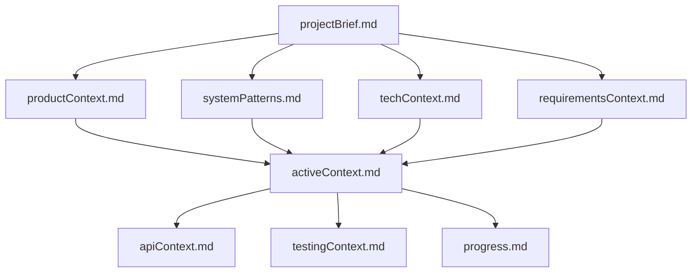
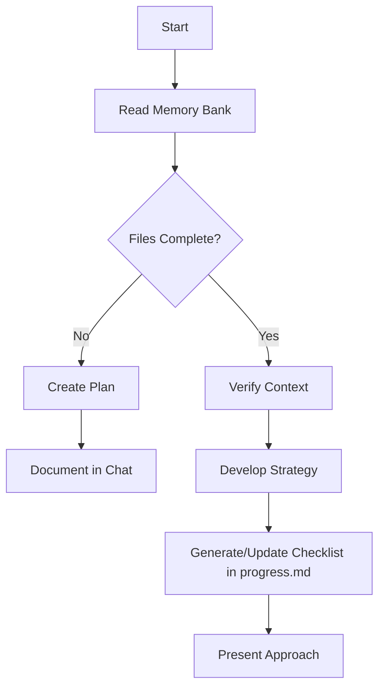
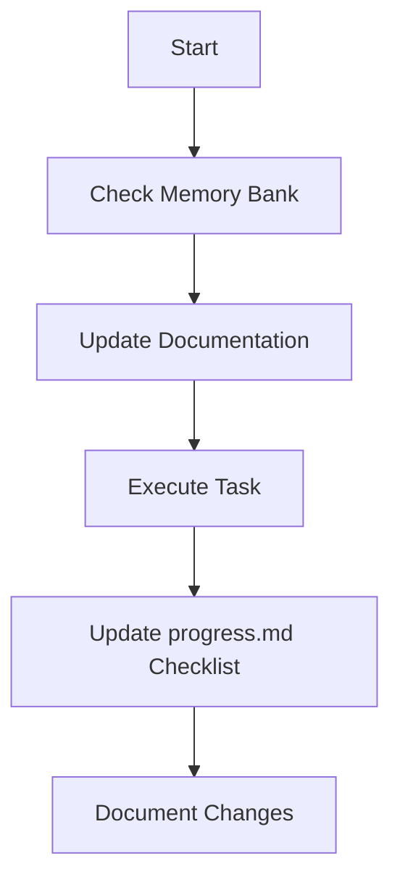
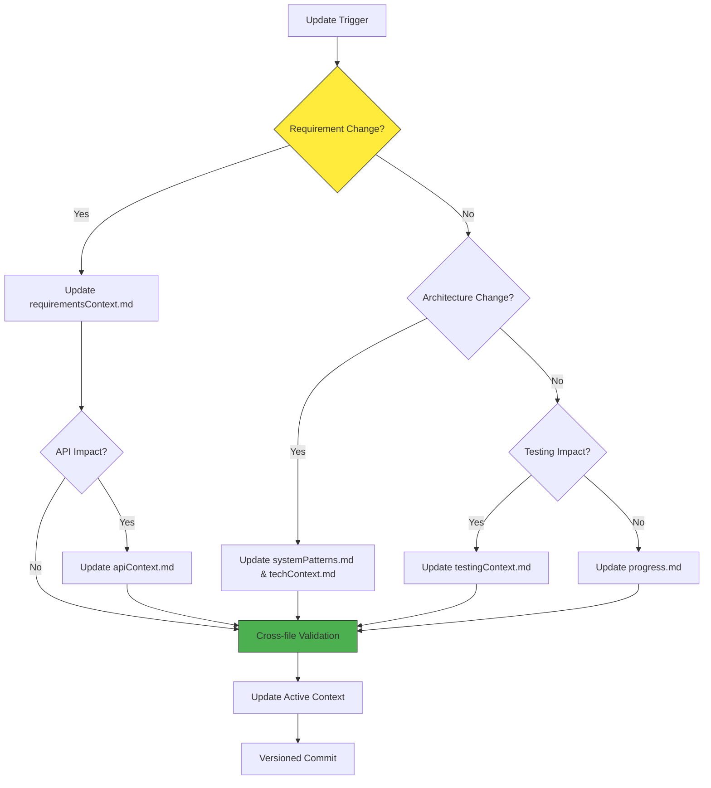

# NuxtUI FastAPI Starter

A starter template integrating Nuxt UI (Vue 3 + Tailwind CSS) frontend with FastAPI (Python) backend, using a structured Memory Bank system for persistent project context across Kilo agent sessions.

## Code Style

- Use TypeScript for all new frontend files; Python 3.10+ for backend files
- Follow Nuxt UI and Tailwind CSS best practices for frontend components
- Adhere to PEP8 for Python backend code, use Black for formatting
- Use 2 spaces for indentation across all file types
- Follow project ESLint/Prettier configuration for frontend, Flake8 for backend
- Validate all schemas with Pydantic (backend) and TypeScript interfaces (frontend)

## Architecture

- Frontend: Nuxt 3 with Nuxt UI component library, Tailwind CSS for styling
- Backend: FastAPI with SQLAlchemy ORM, Celery for background tasks
- Use the structured Memory Bank system (separate files in `memory-bank/` directory) for all project documentation and context retention
- Follow MVC pattern for backend routes, keep frontend components under 200 lines
- Retain separate Memory Bank files as the single source of truth for project context (details below)

## Testing

- Backend: Use `pytest` for unit/integration tests, target >80% code coverage
- Frontend: Use Vitest for unit tests, Cypress for E2E tests
- Write unit tests for all business logic, validate edge cases per `memory-bank/testingContext.md`
- Run tests before committing changes

## Security

- Never commit API keys, secrets, or `.env` files to git (use `.gitignore` exclusions)
- Validate all user inputs via Pydantic schemas (backend) and client-side validation (frontend)
- Use parameterized queries via SQLAlchemy for all database access
- Follow GDPR/CCPA compliance guidelines (details in `memory-bank/complianceContext.md`)
- Use Native JWT for authentication, bcrypt for password hashing

## Memory Bank

Kilo agents operating on this project use a structured Memory Bank system to retain context across sessions, as agent memory resets completely between sessions. This is not a limitation - it drives precise, consistent documentation. After each reset, agents rely ENTIRELY on the Memory Bank to understand the project and continue work effectively. Agents MUST read ALL memory bank files at the start of EVERY task - this is not optional.

### Excluded Files & Concepts

- **memory-bank/prd.md**: This file is explicitly excluded from being read, used, modified, or referenced in any Memory Bank processes unless specifically instructed. It remains a static reference.
<!-- - **memory-bank/sitemap.md**: This file is explicitly excluded from being read or modified unless specifically instructed. -->
- **memory-bank/tsd-\***: Files starting with 'tsd-' are excluded unless specifically instructed.
- **UI/UX Requirements**: Do NOT track, document, or create memory bank sections for UI/UX, styling, wireframes, or frontend design system requirements. Focus exclusively on architecture, logic, APIs, and data flows.

### Memory Bank Structure

The Memory Bank consists of core files in Markdown format (no subdirectories). Files build upon each other in a flat but logically linked hierarchy:



#### Core Files (Required)

1. `projectBrief.md`
   - Foundation document defining scope, vision and business goals
   - Core hypotheses, target audience, and success metrics
   - MVP Launch Timeline and OKRs

2. `productContext.md`
   - Market analysis and competitive landscape differentiation
   - User personas, Jobs-to-be-Done (JTBD) framework, and pain points
   - Edge case scenarios and functional fallbacks

3. `requirementsContext.md`
   - Master list of functional requirements
   - Epics, User Stories, and exact Acceptance Criteria
   - Feature prioritization (MVP P0 vs Post-MVP P1/P2)
   - Cross-referenced logic dependencies

4. `activeContext.md`
   - Current sprint priorities and tradeoffs
   - Critical implementation decisions and rationale
   - Technical debt register and resolution plans
   - Risk assessment matrix with mitigation strategies

5. `systemPatterns.md`
   - Architecture decision records (ADRs)
   - Service boundaries and interaction patterns
   - Data flow diagrams (e.g., Deck creation flow, Celery task flow)
   - Database schemas and ORM relationship mappings

6. `techContext.md`
   - Technology stack details (FastAPI, Nuxt, Celery, SQLAlchemy)
   - Environment configurations and secrets management
   - CI/CD deployment pipelines and infrastructure limits
   - Monitoring, logging (Sentry/CloudWatch), and observability setup

7. `apiContext.md`
   - FastAPI REST routing maps and WebSocket implementations
   - Pydantic schema validation contracts
   - Celery background worker queues and beat schedules
   - Third-party API integration contracts (Scryfall, TCGPlayer)

8. `testingContext.md`
   - Testing strategy and `pytest` coverage targets
   - End-to-end (E2E) testing scenarios
   - Performance and load testing parameters (k6 benchmarks)
   - Edge case handling verifications

9. `complianceContext.md`
   - Data protection implementation matrix (GDPR/CCPA)
   - Regulatory requirement traceability (WotC Fan Content Policy)
   - Security primitives (PCI DSS, Native JWT, password hashing)

10. `progress.md`
    - AARRR metric tracking and KPI status
    - Release readiness checklist with go/no-go criteria
    - Epic/Story completion burndown

| File                   | Purpose                | Includes Checklists?           |
| ---------------------- | ---------------------- | ------------------------------ |
| projectBrief.md        | Strategic alignment    | Verified requirements          |
| productContext.md      | Market/user insights   | JTBD mappings                  |
| requirementsContext.md | Feature scope          | User Story Acceptance Criteria |
| activeContext.md       | Execution focus        | Decision log                   |
| systemPatterns.md      | Architecture blueprint | ADRs                           |
| techContext.md         | Implementation tech    | Env setup lists                |
| apiContext.md          | Backend contracts      | Endpoint validation lists      |
| testingContext.md      | QA & Reliability       | Test pass/fail matrices        |
| complianceContext.md   | Regulatory adherence   | Audit checklists               |
| progress.md            | Health tracking        | Metric dashboards (KPIs)       |

#### Bi-Directional Linking

Because all files are kept in the root `memory-bank/` directory, maintain bi-directional linking between files to connect concepts:

```markdown
[Epic 1: Deck Builder](requirementsContext.md#epic-1) → [Decks Router](apiContext.md#decks-router)
```

### Core Workflows

#### Plan Mode



#### Act Mode



### Documentation Updates

Memory Bank maintenance triggers:

1. Architectural decisions (FastAPI/Celery implementations)
2. API contract changes (Pydantic schema updates)
3. Product requirement changes (PRD updates)
4. Testing threshold breaches or load test findings
5. Sprint retrospectives



Note: When triggered by **update memory bank**, agents MUST review every memory bank file. Focus particularly on `activeContext.md`, `progress.md`, and `apiContext.md` as they track current state. Include checklist status reviews to maintain accuracy across resets.

REMEMBER: After every memory reset, Kilo agents begin completely fresh. The Memory Bank is the only link to previous work. It must be maintained with precision and clarity, as agent effectiveness depends entirely on its accuracy.

```

```
