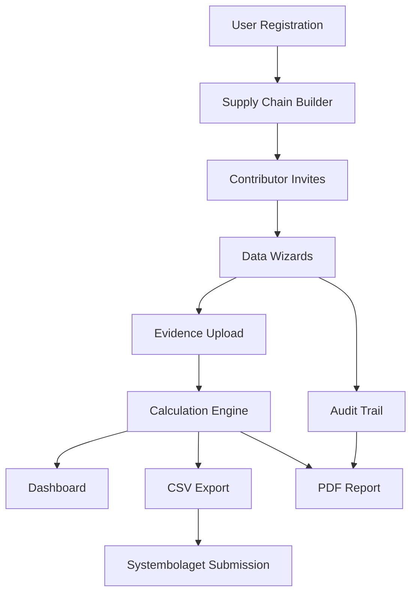

# Requirements Context: EmissioTrace

## Master Requirements List

### Requirement Prioritization Legend

- 🔴 **P0 — Must Have (MVP Launch Blocker)**
- 🟠 **P1 — Should Have (MVP Launch Differentiator)**
- 🟡 **P2 — Could Have (Phase 2, Months 6–12 Post-Launch)**
- 🟢 **P3 — Future Roadmap (Year 2+)**

---

## Epic 1: User Management & Supply Chain Setup

### User Story 1.1: Admin Registration & Company Setup

**As an** Admin (Export Sustainability Manager)  
**I want to** register my company and add my product portfolio  
**So that** I can start tracking carbon footprints for my SKUs

**Acceptance Criteria:**

- [ ] Admin can register with email/password + MFA
- [ ] Admin can create company profile with logo and details
- [ ] Admin can add multiple SKUs (1–50+ products)
- [ ] System supports role-based access (Admin / Contributor / Reviewer)
- [ ] Data encrypted at rest (AES-256)

**Priority:** 🔴 P0  
**Effort:** M  
**Impact:** H

---

### User Story 1.2: Visual Supply Chain Builder

**As an** Admin  
**I want to** build a visual supply chain for each product using drag-drop nodes  
**So that** I can map the full upstream journey (Vineyard → Winery → Bottler → Logistics)

**Acceptance Criteria:**

- [ ] Admin can drag-drop nodes to create supply chain graph
- [ ] Different node types: Cultivation, Production, Packaging, Transport
- [ ] Admin can assign contributors to specific nodes
- [ ] Supply chain templates can be reused across SKUs
- [ ] Visual representation renders correctly on desktop and tablet

**Priority:** 🔴 P0  
**Effort:** L  
**Impact:** H  
**Notes:** Differentiator vs. spreadsheet workflows

---

### User Story 1.3: Contributor Invite System

**As an** Admin  
**I want to** invite contributors via secure tokenized links  
**So that** external parties (grape growers, logistics coordinators) can securely access only their assigned sections

**Acceptance Criteria:**

- [ ] Admin can send invites via email and SMS
- [ ] Token is scoped to single product and single contributor
- [ ] Contributor receives personalized message with context
- [ ] Token expires after 30 days if not used
- [ ] Admin can resend invites with one click

**Priority:** 🔴 P0  
**Effort:** M  
**Impact:** H

---

### User Story 1.4: Automated Reminder Workflow

**As an** Admin  
**I want to** have the system automatically remind contributors about pending submissions  
**So that** I don't have to manually chase 10+ external parties

**Acceptance Criteria:**

- [ ] System sends email reminders after 7 days of no response
- [ ] System sends SMS reminders after 14 days (critical for SA rural reach)
- [ ] Admin can customize reminder frequency
- [ ] Reminder history visible in dashboard

**Priority:** 🟠 P1  
**Effort:** M  
**Impact:** H

---

### User Story 1.5: WhatsApp Business API Reminders

**As an** Admin  
**I want to** send reminders via WhatsApp Business API  
**So that** I can reach contributors on their most-used communication channel

**Acceptance Criteria:**

- [ ] Integration with WhatsApp Business API
- [ ] Template messages approved by WhatsApp
- [ ] Fallback to SMS if WhatsApp unavailable

**Priority:** 🟡 P2  
**Effort:** L  
**Impact:** M  
**Notes:** Highest-engagement channel locally

---

### User Story 1.6: White-Label Branding

**As an** Enterprise customer  
**I want to** customize the platform with my own logo and domain  
**So that** my contributors see a branded experience

**Acceptance Criteria:**

- [ ] Custom logo upload
- [ ] Custom domain mapping (CNAME)
- [ ] Color scheme customization

**Priority:** 🟢 P3  
**Effort:** L  
**Impact:** M  
**Notes:** Premium tier feature

---

## Epic 2: Data Collation Wizards (The 4 Pillars)

### User Story 2.1: Cultivation Wizard

**As a** Contributor (Vineyard Manager)  
**I want to** complete a guided wizard for cultivation data (fertilizer, fuel, yield)  
**So that** I can submit my data without needing technical knowledge

**Acceptance Criteria:**

- [ ] Wizard asks for fertilizer type (dropdown with SA brands pre-loaded)
- [ ] Wizard captures diesel usage for tractors
- [ ] Wizard captures yield per hectare
- [ ] All fields have contextual help explaining why data is needed
- [ ] Data encrypted and confidential

**Priority:** 🔴 P0  
**Effort:** M  
**Impact:** H  
**Notes:** SA-specific fertilizer brands pre-loaded

---

### User Story 2.2: Production Wizard

**As a** Contributor (Winery Operations)  
**I want to** complete a guided wizard for production data (Eskom grid + diesel genset hours)  
**So that** energy consumption data is accurately captured

**Acceptance Criteria:**

- [ ] Wizard captures Eskom grid electricity usage (kWh)
- [ ] Wizard captures diesel genset hours (critical for load-shedding periods)
- [ ] System auto-applies Eskom grid emission factor (~0.95 kgCO₂e/kWh)
- [ ] Load-shedding hours specifically capturable

**Priority:** 🔴 P0  
**Effort:** M  
**Impact:** H

---

### User Story 2.3: Packaging Wizard

**As a** Contributor (Bottler)  
**I want to** complete a guided wizard for packaging data (glass weight, closures, recycled %)  
**So that** packaging emissions are accurately calculated

**Acceptance Criteria:**

- [ ] Wizard includes dropdown library of SA packaging suppliers
- [ ] Captures glass weight, closure type, recycled content %
- [ ] System auto-applies packaging emission factors

**Priority:** 🔴 P0  
**Effort:** M  
**Impact:** H  
**Notes:** Dropdown library of SA packaging suppliers

---

### User Story 2.4: Transport Wizard

**As a** Contributor (Logistics Coordinator)  
**I want to** complete a guided wizard for transport data (multimodal: truck → port → ship)  
**So that** logistics emissions are captured end-to-end

**Acceptance Criteria:**

- [ ] Wizard supports multimodal transport entries
- [ ] Cape Town → Gothenburg route templates pre-loaded
- [ ] Captures road freight (truck) and ocean freight (ship) distances
- [ ] System auto-applies DEFRA HGV factors and IMO Clean Cargo factors

**Priority:** 🔴 P0  
**Effort:** L  
**Impact:** H  
**Notes:** Cape Town → Gothenburg route templates

---

### User Story 2.5: Bilingual UI (English/Afrikaans)

**As a** Contributor  
**I want to** switch the entire UI between English and Afrikaans  
**So that** I can complete forms in my preferred language

**Acceptance Criteria:**

- [ ] Language toggle available on every page
- [ ] All wizard text, labels, and help text translated
- [ ] Language preference persisted per user
- [ ] Contributor invite emails/SMS sent in preferred language

**Priority:** 🟠 P1  
**Effort:** M  
**Impact:** H  
**Notes:** Strategic differentiator

---

### User Story 2.6: Mobile-Responsive Contributor Forms

**As a** Contributor using a mobile device  
**I want to** complete wizards on my Android phone  
**So that** I can submit data from the field (vineyard)

**Acceptance Criteria:**

- [ ] All wizard pages responsive on screens 320px wide
- [ ] Touch-friendly inputs (large buttons, easy scrolling)
- [ ] Works on Android 8+ devices with 2GB RAM
- [ ] Optimized for 3G networks (minimal data usage)

**Priority:** 🟠 P1  
**Effort:** M  
**Impact:** H  
**Notes:** Critical for vineyard managers

---

### User Story 2.7: Offline Data Entry with Sync

**As a** Contributor with intermittent connectivity  
**I want to** enter data offline and sync when online  
**So that** I can work despite poor rural connectivity

**Acceptance Criteria:**

- [ ] PWA (Progressive Web App) with offline caching
- [ ] Data stored locally in IndexedDB
- [ ] Automatic sync when connection restored
- [ ] Conflict resolution if admin modifies same data

**Priority:** 🟡 P2  
**Effort:** L  
**Impact:** M

---

### User Story 2.8: CSV Bulk Import for Power Users

**As an** Admin with 20+ SKUs  
**I want to** import data via CSV spreadsheet  
**So that** I can quickly populate the system for large portfolios

**Acceptance Criteria:**

- [ ] CSV template download with required columns
- [ ] Validation errors highlighted in import preview
- [ ] Bulk import mapped to appropriate wizards

**Priority:** 🟡 P2  
**Effort:** M  
**Impact:** M  
**Notes:** For 20+ SKU portfolios

---

## Epic 3: Document & Evidence Vault

### User Story 3.1: Drag-Drop File Upload

**As a** Contributor  
**I want to** upload evidence documents by dragging and dropping  
**So that** I can attach invoices, bills, and certificates to my submissions

**Acceptance Criteria:**

- [ ] Supports PDF, JPG, PNG, XLSX formats
- [ ] Drag-drop zone clearly visible in wizards
- [ ] Multiple file upload in single action
- [ ] File size limit: 10MB per file

**Priority:** 🔴 P0  
**Effort:** S  
**Impact:** H

---

### User Story 3.2: Encrypted Document Storage

**As an** Admin  
**I want to** store all evidence documents with AES-256 encryption  
**So that** commercial confidentiality is protected

**Acceptance Criteria:**

- [ ] Documents encrypted at rest using AES-256
- [ ] Per-tenant encryption keys
- [ ] Self-hosted MinIO or local SA cloud storage
- [ ] Access logged for audit trail

**Priority:** 🔴 P0  
**Effort:** M  
**Impact:** H

---

### User Story 3.3: Full Audit Trail

**As a** Reviewer  
**I want to** see an immutable log of who changed what and when  
**So that** the data is defensible for ISO 14067 compliance

**Acceptance Criteria:**

- [ ] Every field change logged (who, what, when, previous value)
- [ ] Evidence document uploads logged
- [ ] Audit trail exportable as PDF appendix
- [ ] Logs cannot be deleted or modified (immutable)

**Priority:** 🔴 P0  
**Effort:** M  
**Impact:** H  
**Notes:** Critical for ISO 14067 compliance

---

### User Story 3.4: Reviewer Commenting & Query Workflow

**As a** Reviewer  
**I want to** add comments and raise queries on specific data points  
**So that** I can verify entries before final submission

**Acceptance Criteria:**

- [ ] Comment threads attached to specific fields
- [ ] Query status tracking (Open, Resolved)
- [ ] Contributor notified of queries via email/SMS
- [ ] Reviewer can approve/reject sections

**Priority:** 🟠 P1  
**Effort:** M  
**Impact:** H  
**Notes:** Allows internal verification before submission

---

### User Story 3.5: OCR Auto-Extraction from Utility Bills

**As a** Contributor  
**I want to** have the system automatically extract data from uploaded utility bills  
**So that** I don't have to manually type numbers from PDF invoices

**Acceptance Criteria:**

- [ ] OCR extracts kWh from electricity bills
- [ ] OCR extracts diesel liters from fuel invoices
- [ ] Extracted data pre-fills wizard fields
- [ ] Confidence score shown; manual override allowed

**Priority:** 🟡 P2  
**Effort:** L  
**Impact:** M  
**Notes:** Reduces contributor burden significantly

---

### User Story 3.6: Verification Badges on Documents

**As a** Reviewer  
**I want to** apply verification badges to approved documents  
**So that** the output reports show which data has been verified

**Acceptance Criteria:**

- [ ] Badge displayed on document thumbnails
- [ ] Badge appears on exported PDF reports
- [ ] Badge tied to Reviewer's digital signature

**Priority:** 🟠 P1  
**Effort:** S  
**Impact:** M  
**Notes:** Trust signal in output reports

---

## Epic 4: Calculation Engine & Reporting

### User Story 4.1: SA-Localized Emission Factor Library ⭐

**As an** Admin  
**I want to** use a curated South African emission factor database  
**So that** my calculations reflect local conditions (Eskom grid, SA agriculture)

**Acceptance Criteria:**

- [ ] **Electricity:** Eskom grid emission factor (~0.95 kgCO₂e/kWh, updated annually)
- [ ] **Diesel/Genset:** DEFRA combustion factors (critical for load-shedding)
- [ ] **Agricultural Inputs:** EcoInvent licensed data + SAWIS practice data
- [ ] **Packaging:** EcoInvent materials + SA-specific transport additions (Consol Glass)
- [ ] **Ocean Freight:** IMO + Clean Cargo Working Group factors (Cape Town → Northern Europe)
- [ ] **Road Freight:** DEFRA HGV factors (SA fleet profile similar to EU)
- [ ] Factor library versioned (v1.0, v1.1, etc.)
- [ ] Methodology whitepaper published and endorsable by SAWIS/WWF-SA

**Priority:** 🔴 P0  
**Effort:** L  
**Impact:** H  
**Notes:** **Methodological moat** — defensible asset

---

### User Story 4.2: Real-Time CO₂e Calculation per Product

**As an** Admin  
**I want to** see real-time carbon footprint calculations as data is entered  
**So that** I can identify hotspots and optimize quickly

**Acceptance Criteria:**

- [ ] Calculation triggered on every wizard submission
- [ ] Formula: Activity × Emission Factor with system boundary logic
- [ ] Supports multiple system boundaries (cradle-to-gate, cradle-to-grave)
- [ ] Calculation results cached for performance

**Priority:** 🔴 P0  
**Effort:** M  
**Impact:** H

---

### User Story 4.3: Dashboard with 4-Pillar Contribution Breakdown

**As an** Admin  
**I want to** see a visual dashboard showing CO₂e contribution by pillar (Cultivation, Production, Packaging, Transport)  
**So that** I can tell a visual story to management

**Acceptance Criteria:**

- [ ] Pie chart or stacked bar showing 4-pillar breakdown
- [ ] Drill-down to see contributor-level details
- [ ] Year-over-year comparison (when historical data exists)
- [ ] Export chart as image for presentations

**Priority:** 🔴 P0  
**Effort:** M  
**Impact:** H  
**Notes:** Visual storytelling for management

---

### User Story 4.4: Systembolaget/CarbonCloud CSV Export

**As an** Admin  
**I want to** export a CSV file formatted exactly for Systembolaget's submission gateway  
**So that** I can upload directly to CarbonCloud without manual reformatting

**Acceptance Criteria:**

- [ ] CSV columns match Systembolaget/CarbonCloud specification
- [ ] Format validated against known working examples
- [ ] Export includes all required SKU metadata
- [ ] Export template configurable (not hardcoded) to handle format changes

**Priority:** 🔴 P0  
**Effort:** M  
**Impact:** H  
**Notes:** Format-matched to current submission gateway

---

### User Story 4.5: PDF Report with Verification Trail

**As an** Admin  
**I want to** generate a branded PDF report with full verification trail  
**So that** I have an audit-ready document for ISO 14067 compliance

**Acceptance Criteria:**

- [ ] PDF includes company branding (logo, colors)
- [ ] PDF includes 4-pillar breakdown charts
- [ ] PDF includes verification badges and Reviewer signatures
- [ ] PDF includes appendix with audit trail log
- [ ] PDF exportable per SKU or for entire portfolio

**Priority:** 🔴 P0  
**Effort:** M  
**Impact:** H  
**Notes:** Branded, audit-ready output

---

### User Story 4.6: Multi-Framework Export (UK PAS 2050, EU PEF)

**As an** Admin exporting to multiple markets  
**I want to** export reports in different regulatory frameworks  
**So that** I can satisfy UK, EU, and Nordic buyers with one platform

**Acceptance Criteria:**

- [ ] Export template for UK PAS 2050
- [ ] Export template for EU Product Environmental Footprint (PEF)
- [ ] Export template for CDP (Carbon Disclosure Project)

**Priority:** 🟡 P2  
**Effort:** L  
**Impact:** M  
**Notes:** Phase 2 expansion driver

---

### User Story 4.7: Year-Over-Year Emission Trends

**As an** Admin  
**I want to** see how my emissions change year-over-year  
**So that** I can track progress on sustainability goals

**Acceptance Criteria:**

- [ ] Trend line chart showing CO₂e per SKU over years
- [ ] Breakdown by pillar for each year
- [ ] Anonymized peer benchmarking (opt-in)

**Priority:** 🟡 P2  
**Effort:** M  
**Impact:** M  
**Notes:** Customer retention feature

---

### User Story 4.8: Benchmark Mode (Anonymized Peer Comparison)

**As an** Admin  
**I want to** compare my emissions against anonymized industry averages  
**So that** I can see where I stand relative to peers

**Acceptance Criteria:**

- [ ] Industry average calculated from platform data (anonymized)
- [ ] Benchmark shown as percentile ranking
- [ ] Requires minimum 50 participants for statistical significance

**Priority:** 🟢 P3  
**Effort:** L  
**Impact:** M  
**Notes:** Network effect feature, requires scale

---

## Cross-Cutting Concerns

### Security Requirements

- [ ] Email/password authentication with MFA (TOTP or SMS)
- [ ] Role-based access control (Admin, Contributor, Reviewer)
- [ ] Per-tenant data isolation (PostgreSQL row-level security)
- [ ] AES-256 encryption at rest for documents and sensitive fields
- [ ] HTTPS/TLS 1.3 for all communications
- [ ] Secure tokenized invite links (JWT-signed, 30-day expiry)

### Compliance Requirements

- [ ] Full audit trail for ISO 14067 compliance
- [ ] Data retention policy (7 years for audit documents)
- [ ] GDPR compliance for EU buyer data (via SCCs)
- [ ] Right to be forgotten (data deletion on request)

### Performance Requirements

- [ ] Dashboard loads < 2 seconds for 20 SKUs
- [ ] Wizard saves progress automatically (every 30 seconds)
- [ ] CSV export generates < 5 seconds for 50 SKUs
- [ ] PDF report generates < 10 seconds for single SKU

### Usability Requirements

- [ ] Mobile-responsive (320px to 1920px)
- [ ] Bilingual UI (English/Afrikaans) with one-click switch
- [ ] Contextual help tooltips on all wizard fields
- [ ] Error messages human-readable (no technical jargon)

---

## Feature Dependency Map

---

## Document History

- **Created:** 2026-05-28
- **Version:** 1.0
- **Authors:** Cline (AI Engineer)
- **Approved By:** Pending
- **Next Review:** Post-MVP Launch (Month 6)
