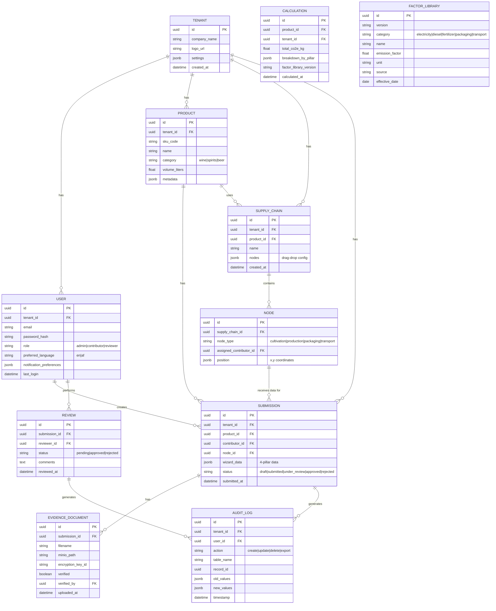

# System Patterns: EmissioTrace

## Architecture Decision Records (ADRs)

### ADR 001: Self-Hosted Infrastructure on Teraco (SA-Local)

**Status:** Accepted  
**Date:** 2026-05-28  
**Context:** Need to decide hosting strategy for EmissioTrace platform serving South African beverage exporters.  
**Decision:** Deploy on Teraco data centres (Cape Town or Johannesburg) with self-hosted Kubernetes (k3s).  
**Rationale:**

- Data residency expectations of EU buyers under GDPR via SCCs
- Cost economics favorable for SA-based hosting
- Full control over infrastructure stack
- Strategic differentiator: "SA-localized platform for SA exporters"

**Tradeoffs:**

- ✅ Lower latency for SA users
- ✅ Data sovereignty messaging
- ❌ Operational burden (need dedicated DevOps)
- ❌ No out-of-the-box global CDN (mitigated with Cloudflare)

**Consequences:**

- Budget R35,000–R50,000/month for infrastructure + DevOps support
- Hire DevOps engineer from Month 2 of build

---

### ADR 002: PostgreSQL with Row-Level Security for Multi-Tenancy

**Status:** Accepted  
**Date:** 2026-05-28  
**Context:** Need tenant isolation for SaaS platform with multiple wine exporter companies.  
**Decision:** Use PostgreSQL with row-level security (RLS) policies per tenant.  
**Rationale:**

- Mature, well-understood technology
- Native support for row-level security (tenant isolation)
- Cost-effective (no per-tenant database overhead)
- Strong ACID compliance for financial/audit data

**Tradeoffs:**

- ✅ Single database, multiple tenants (cost-effective)
- ✅ RLS policies enforce isolation at DB level (defense in depth)
- ❌ Shared database = noisy neighbor risk (mitigated with connection pooling)
- ❌ Backup/restore per tenant more complex (mitigated with tenant_id filtering)

**Consequences:**

- All tables must have `tenant_id` column
- All queries must filter by `tenant_id` (enforced via RLS policies)
- Backup strategy: Daily full backup + WAL archiving

---

### ADR 003: MinIO for Encrypted Document Storage

**Status:** Accepted  
**Date:** 2026-05-28  
**Context:** Need to store evidence documents (PDF invoices, utility bills) with strong encryption and tenant isolation.  
**Decision:** Use MinIO (S3-compatible, self-hosted) with per-tenant encryption keys.  
**Rationale:**

- S3-compatible API (standard for object storage)
- Self-hosted (data residency compliance)
- Per-tenant encryption keys (strong isolation)
- Open-source, no licensing costs

**Tradeoffs:**

- ✅ Full control over data location
- ✅ AES-256 encryption at rest
- ❌ Operational overhead (need to manage MinIO cluster)
- ❌ No native versioning (mitigated with application-level versioning)

**Consequences:**

- Documents stored as `tenant_id/document_id/filename`
- Encryption keys rotated every 90 days
- Cross-region replication to second Teraco data centre

---

### ADR 004: FastAPI + React (Nuxt 3) for Frontend-Backend Separation

**Status:** Accepted  
**Date:** 2026-05-28  
**Context:** Need to choose technology stack for web application with complex wizards and real-time calculations.  
**Decision:** FastAPI (Python) backend + Nuxt 3 (Vue 3) frontend.  
**Rationale:**

- FastAPI: Excellent for data processing, Pydantic validation, async support
- Nuxt 3: SSR/SSG capabilities, excellent DX, built-in i18n support
- Separation of concerns: Backend handles calculations, frontend handles UI
- Python ecosystem for emissions calculations (NumPy, Pandas)

**Tradeoffs:**

- ✅ Best-in-class DX for both frontend and backend
- ✅ FastAPI auto-generates OpenAPI docs (easy integration)
- ❌ Two codebases to maintain (mitigated with monorepo structure)
- ❌ CORS complexity (mitigated with Nginx reverse proxy)

**Consequences:**

- Monorepo structure: `/api` (FastAPI) + `/app` (Nuxt 3)
- Shared TypeScript interfaces via `@shared/types` package
- Nginx reverse proxy routes `/api/*` to FastAPI, all other routes to Nuxt

---

### ADR 005: Celery for Background Task Processing

**Status:** Accepted  
**Date:** 2026-05-28  
**Context:** Need to handle long-running tasks (CSV export, PDF generation, reminder emails) without blocking HTTP requests.  
**Decision:** Use Celery with Redis as message broker for background task processing.  
**Rationale:**

- Industry-standard for Python background tasks
- Redis as broker: fast, lightweight
- Supports task retries, rate limiting, and scheduling (Celery Beat for reminders)
- Horizontal scaling: Add more Celery workers as load increases

**Tradeoffs:**

- ✅ Reliable background processing
- ✅ Task monitoring via Flower dashboard
- ❌ Additional infrastructure component (Redis)
- ❌ Complexity in debugging task failures

**Consequences:**

- Celery workers run as separate containers in k3s cluster
- Flower dashboard for monitoring task status
- Celery Beat for automated reminder scheduling

---

### ADR 006: SA-Localized Emission Factor Library as Proprietary Asset

**Status:** Accepted  
**Date:** 2026-05-28  
**Context:** Need to calculate accurate CO₂e emissions for South African beverage exporters. Generic emission factors (DEFRA, EPA) are inaccurate for SA context (Eskom grid ~0.95 kgCO₂e/kWh vs. UK grid ~0.25 kgCO₂e/kWh).  
**Decision:** Build proprietary "EmissioTrace Factor Library v1.0" combining licensed EcoInvent data with SA-specific factors.  
**Rationale:**

- **Methodological moat:** Defensible asset competitors cannot easily replicate
- Eskom grid factor updated annually (publicly available)
- SA wine industry specificity (SAWIS data partnership)
- Route-specific ocean freight (Cape Town → Northern Europe)

**Tradeoffs:**

- ✅ Strong differentiator vs. generic LCA tools
- ✅ Scientifically defensible methodology
- ❌ Licensing costs (EcoInvent ~€5,000 one-time)
- ❌ Ongoing maintenance (annual factor updates)

**Consequences:**

- Factor library stored in PostgreSQL with versioning (`factor_library_v1_0`, `v1_1`, etc.)
- Methodology whitepaper published for transparency
- Pursue endorsement from SAWIS or WWF-SA

---

## Service Boundaries & Interaction Patterns

### High-Level Architecture

```
┌─────────────────────────────────────────────────────────────┐
│                        Nginx Reverse Proxy                 │
│                   (Routes /api/* to FastAPI)              │
└─────────────────────────────────────────────────────────────┘
           │                                           │
           ▼                                           ▼
┌──────────────────┐                          ┌──────────────────┐
│   Nuxt 3 App    │                          │   FastAPI App    │
│ (Vue 3 + SSR)  │◄──── REST API ────────►│  (Python 3.11)  │
│  Port: 3000    │                          │   Port: 8000     │
└──────────────────┘                          └──────────────────┘
                                                       │
           ┌─────────────────────────────────────────┘
           │
           ▼
┌──────────────────┐    ┌──────────────────┐    ┌──────────────────┐
│  PostgreSQL DB   │    │   Redis Broker   │    │   MinIO Storage  │
│ (Tenant RLS)    │    │ (Celery Tasks)  │    │ (Encrypted Docs) │
│   Port: 5432    │    │   Port: 6379    │    │   Port: 9000     │
└──────────────────┘    └──────────────────┘    └──────────────────┘
           │
           ▼
┌──────────────────┐
│  Celery Workers  │
│ (Background Tasks)│
└──────────────────┘
```

### Service Responsibilities

| Service            | Responsibility                                                          | Technology                        |
| ------------------ | ----------------------------------------------------------------------- | --------------------------------- |
| **Nuxt 3 App**     | UI rendering, wizard workflows, bilingual i18n, mobile-responsive pages | Vue 3, Nuxt 3, Tailwind CSS       |
| **FastAPI App**    | REST API, authentication (MFA), Pydantic validation, CO₂e calculations  | Python 3.11, FastAPI, Pydantic v2 |
| **PostgreSQL**     | Tenant-isolated data storage, audit trail logs, factor library          | PostgreSQL 16, Row-Level Security |
| **Redis**          | Celery task broker, session storage, rate limiting                      | Redis 7                           |
| **MinIO**          | Encrypted document storage (PDF, JPG, XLSX)                             | MinIO (S3-compatible)             |
| **Celery Workers** | Background tasks: CSV export, PDF generation, reminder emails/SMS       | Celery, Flower (monitoring)       |

---

## Data Flow Diagrams

### Flow 1: Supply Chain Creation (Admin)

```
[Admin] ──► [Nuxt 3 Frontend] ──► [FastAPI POST /api/supply-chains]
                                    │
                                    ▼
                            [Validate Payload (Pydantic)]
                                    │
                                    ▼
                ┌───────────────────────────────────────┐
                │  PostgreSQL: INSERT supply_chains    │
                │  - tenant_id (from JWT)             │
                │  - name, description                │
                │  - nodes (JSONB: drag-drop config)  │
                └───────────────────────────────────────┘
                                    │
                                    ▼
                            [Return 201 Created + supply_chain_id]
                                    │
                                    ▼
                        [Nuxt 3: Redirect to Supply Chain Detail]
```

---

### Flow 2: Contributor Invite & Data Submission

```
[Admin] ──► [Nuxt 3: Invite Contributor Form]
               │
               ▼
         [FastAPI POST /api/invites]
               │
               ▼
     ┌─────────────────────────────┐
     │ Generate JWT-signed token    │
     │ - contributor_id             │
     │ - product_id                │
     │ - expiry: 30 days          │
     └─────────────────────────────┘
               │
               ▼
     [Celery Task: Send Email/SMS]
               │
               ▼
     [Contributor Clicks Link] ──► [Nuxt 3: Accept Invite Page]
                                    │
                                    ▼
                          [FastAPI GET /api/invites/{token}]
                                    │
                                    ▼
                        [Validate Token (not expired, not used)]
                                    │
                                    ▼
                    [Contributor Completes Wizard] ──► [FastAPI POST /api/submissions]
                                                        │
                                                        ▼
                                              [Validate Data (Pydantic)]
                                                        │
                                                        ▼
                                        ┌───────────────────────────────────────┐
                                        │  PostgreSQL: INSERT submissions        │
                                        │  - tenant_id                          │
                                        │  - contributor_id                     │
                                        │  - product_id                        │
                                        │  - wizard_data (JSONB)              │
                                        │  - status: "pending_review"          │
                                        └───────────────────────────────────────┘
                                                        │
                                                        ▼
                                            [Audit Trail: Log submission event]
                                                        │
                                                        ▼
                                          [Notify Reviewer via Email/SMS]
```

---

### Flow 3: CO₂e Calculation Engine

```
[Contributor Submission] ──► [FastAPI Trigger Calculation]
                                │
                                ▼
                    ┌───────────────────────────────────────┐
                    │  Fetch Emission Factors from Library    │
                    │  - Electricity: Eskom grid (0.95)    │
                    │  - Diesel: DEFRA combustion           │
                    │  - Fertilizer: EcoInvent + SAWIS     │
                    │  - Packaging: EcoInvent + Consol     │
                    │  - Transport: IMO + DEFRA HGV        │
                    └───────────────────────────────────────┘
                                │
                                ▼
                    [Calculate: Activity × Emission Factor]
                                │
                                │  Example:
                                │  - Electricity: 10,000 kWh × 0.95 = 9,500 kgCO₂e
                                │  - Diesel: 500 L × 2.68 kgCO₂e/L = 1,340 kgCO₂e
                                │  - Total: 10,840 kgCO₂e per SKU
                                │
                                ▼
                    ┌───────────────────────────────────────┐
                    │  PostgreSQL: INSERT calculations      │
                    │  - product_id                        │
                    │  - total_co2e_kg                     │
                    │  - breakdown by pillar (JSONB)        │
                    │  - factor_library_version             │
                    └───────────────────────────────────────┘
                                │
                                ▼
                        [Update Dashboard Cache (Redis)]
                                │
                                ▼
                      [Nuxt 3: Real-time Dashboard Update]
```

---

### Flow 4: Systembolaget CSV Export

```
[Admin Clicks "Export"] ──► [FastAPI POST /api/exports]
                                │
                                ▼
                    [Celery Task: Generate CSV]
                                │
                                ▼
            ┌───────────────────────────────────────────────┐
            │  Fetch Product Data + Calculations            │
            │  - SKU ID, Name, Volume                    │
            │  - Total CO₂e, Breakdown by Pillar          │
            │  - Methodology: EmissioTrace v1.0          │
            └───────────────────────────────────────────────┘
                                │
                                ▼
            ┌───────────────────────────────────────────────┐
            │  Format as Systembolaget/CarbonCloud CSV     │
            │  - Columns: sku_id, co2e_total, ...        │
            │  - Match specification (configurable template) │
            └───────────────────────────────────────────────┘
                                │
                                ▼
                    [Save to MinIO: /exports/{export_id}.csv]
                                │
                                ▼
                        [Email Admin: Download Link]
                                │
                                ▼
                    [Admin Downloads CSV] ──► [Upload to Systembolaget]
```

---

## Database Schema & ORM Relationships

### Core Entities (PostgreSQL + SQLAlchemy)



### Key Relationships Explanation

1. **Tenant Isolation:** Every table has `tenant_id` column. Row-Level Security (RLS) policies enforce that users can only access data from their own tenant.

2. **Supply Chain → Nodes:** A supply chain (e.g., "Sauvignon Blanc 2025") consists of multiple nodes (Cultivation, Production, Packaging, Transport). Each node can be assigned to a different contributor.

3. **Submission → Evidence Documents:** Each submission (contributor's wizard data) can have multiple evidence documents (PDF invoices, photos). Documents are stored in MinIO with per-tenant encryption.

4. **Audit Log (Immutable):** Every create/update/delete action is logged in `audit_log` table. Logs cannot be modified or deleted (compliance requirement for ISO 14067).

5. **Calculation → Factor Library:** Calculations reference a specific version of the factor library (e.g., "v1.0"). This ensures reproducibility: recalculating with same factor version yields same result.

---

## Security Patterns

### Authentication Flow (MFA with TOTP)

```
[User Login] ──► [FastAPI POST /api/auth/login]
                   │
                   ▼
         ┌─────────────────────────────┐
         │  Validate email/password    │
         │  - Check password hash      │
         │  - Check if MFA enabled     │
         └─────────────────────────────┘
                   │
         ┌─────────┴─────────┐
         │                   │
    MFA NOT ENABLED    MFA ENABLED
         │                   │
         ▼                   ▼
   [Return JWT]    [FastAPI POST /api/auth/verify-mfa]
                           │
                           ▼
                ┌─────────────────────────────┐
                │  Validate TOTP code         │
                │  - 6-digit code from app  │
                │  - Check against secret     │
                └─────────────────────────────┘
                           │
                           ▼
                  [Return JWT (with MFA claim)]
```

### Authorization (Role-Based Access Control)

| Role            | Permissions                                                                                                                                                                                 |
| --------------- | ------------------------------------------------------------------------------------------------------------------------------------------------------------------------------------------- |
| **Admin**       | - Create/edit/delete products and supply chains<br>- Invite contributors and reviewers<br>- View all submissions and audit logs<br>- Export reports (CSV, PDF)<br>- Manage company settings |
| **Contributor** | - View assigned nodes only<br>- Complete wizards for assigned nodes<br>- Upload evidence documents<br>- View own submission status                                                          |
| **Reviewer**    | - View all submissions (read-only)<br>- Add comments and queries<br>- Approve/reject submissions<br>- Apply verification badges                                                             |

**Implementation:** FastAPI dependencies (`get_current_user`, `require_role(["admin"])`) enforce role-based access on every protected endpoint.

---

## Performance Patterns

### Caching Strategy (Redis)

| Cache Key Pattern                           | TTL        | Invalidation                |
| ------------------------------------------- | ---------- | --------------------------- |
| `dashboard:{tenant_id}:{product_id}`        | 5 minutes  | On submission create/update |
| `calculation:{product_id}:{factor_version}` | 1 hour     | On factor library update    |
| `factor_library:{version}`                  | 24 hours   | On factor library update    |
| `session:{user_id}`                         | 30 minutes | On logout                   |

### Database Query Optimization

1. **Indexes:**
   - `tenant_id` on all tables (for RLS performance)
   - `product_id` on `submissions` table (for dashboard queries)
   - `status` on `submissions` table (for pending review queries)
   - `timestamp` on `audit_log` table (for compliance reporting)

2. **Pagination:**
   - All list endpoints (`GET /api/products`, `GET /api/submissions`) support `limit` and `offset` parameters
   - Default: `limit=20`, `offset=0`
   - Max: `limit=100` (prevent excessive data transfer)

3. **Connection Pooling:**
   - PostgreSQL: `pool_size=20`, `max_overflow=10`
   - Redis: `max_connections=50`

---

## Deployment Architecture (Teraco)

```
┌─────────────────────────────────────────────────────────────┐
│                      Teraco Data Centre (CPT)              │
│  ┌─────────────────────────────────────────────────────┐   │
│  │              k3s Kubernetes Cluster                 │   │
│  │  ┌──────────┐  ┌──────────┐  ┌──────────┐      │   │
│  │  │  Nuxt 3  │  │ FastAPI  │  │  Celery  │      │   │
│  │  │ (3 pods)  │  │ (5 pods)  │  │ (2 pods)  │      │   │
│  │  └──────────┘  └──────────┘  └──────────┘      │   │
│  │                                                    │   │
│  │  ┌──────────┐  ┌──────────┐  ┌──────────┐      │   │
│  │  │PostgreSQL │  │  Redis   │  │  MinIO   │      │   │
│  │  │ (Primary) │  │ (Master) │  │ (Single) │      │   │
│  │  └──────────┘  └──────────┘  └──────────┘      │   │
│  └─────────────────────────────────────────────────────┘   │
│                                                          │   │
│  ┌─────────────────────────────────────────────────────┐   │
│  │         Cross-Region Replication (To JHB)           │   │
│  │  - PostgreSQL: Async replication (WAL streaming)    │   │
│  │  - MinIO: Bucket replication (daily)               │   │
│  │  - Redis: AOF persistence (snapshot every 15 min)  │   │
│  └─────────────────────────────────────────────────────┘   │
└─────────────────────────────────────────────────────────────┘
```

**Disaster Recovery:**

- RTO (Recovery Time Objective): 4 hours
- RPO (Recovery Point Objective): 15 minutes (Redis AOF)
- Daily offsite backups to separate Teraco facility

---

## Document History

- **Created:** 2026-05-28
- **Version:** 1.0
- **Authors:** Cline (AI Engineer)
- **Approved By:** Pending
- **Next Review:** Post-Architecture Review (Month 1)
